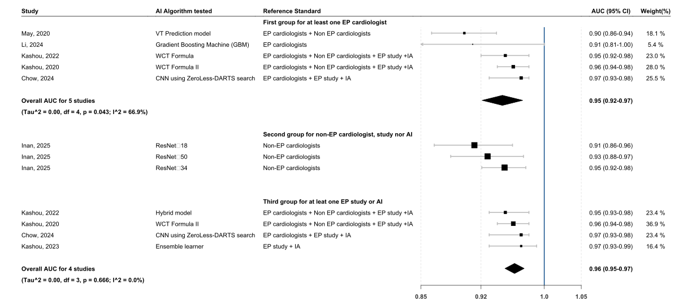
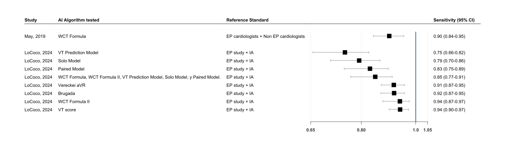
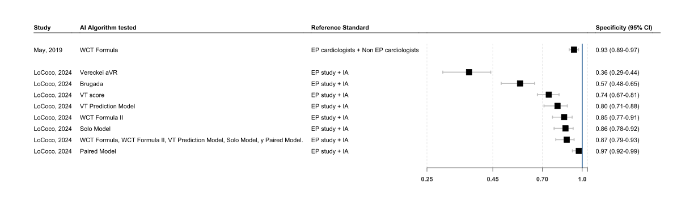

Meta-analysis AI algorithms against non-experts, experts, and scores
================
Luis A. Figueroa, Marcelo Montero, Alisson Samaniego, et. al.

<i> Analysis and visualization developed by [Luis A.
Figueroa](https://www.linkedin.com/in/luis-figueroa-200851374/) </i>

We built this project to show the meta-analysis AI algorithms (RWPT-II
algorithm, Basel algorithm, WCT Formula, WCT Formula II, VT Prediction
Model, Solo Model, Paired Model, VT score, Bayesian algorithm) against
Gold Standard (Humans experts <electrophysiology>, humans non-experts
<general>, and score algorithms) allowing transparency and
reproducibility.

### METHODOLOGY

We conducted a meta-analysis focusing on performance metrics reported
according to three different reference standards. AI algorithms were
compared with electrophysiologists (EP), non-EP cardiologists,
electrophysiologic studies, and other AI models. At least four studies
provided sufficient information to calculate pooled effect sizes for
each comparison.

Area under the receiver operating characteristic curve (AUC) values and
their corresponding 95% confidence intervals were extracted from the
included studies, and a pooled estimate was obtained using a
Random-Effects Model. true positives (TP), false positives (FP), false
negatives (FN), and true negatives (TN) were not always available.
Forest plots were constructed to summarize pooled estimates and, when
available, sensitivity and specificity. Sensitivity analyses were
performed when multiple AI models were evaluated in the same study
population.

Statistical analyses were performed using R 4.4.2 and RStudio. `metafor`
and `forestplot` packages were used to perform the meta-analyses and
generate graphical summaries.

### Forest plots

AUC for all reference standards

<!-- -->

Sensitivity for all reference standards

<!-- -->

Specificity for all reference standards

<!-- -->

